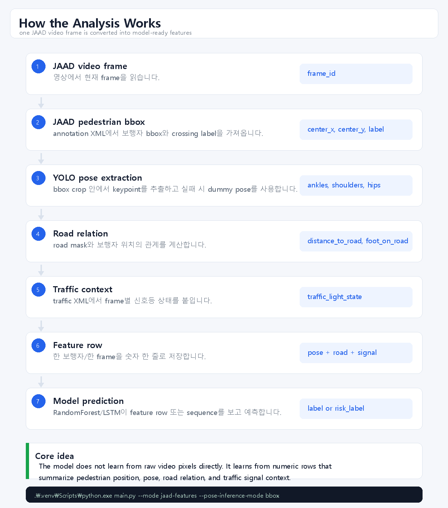
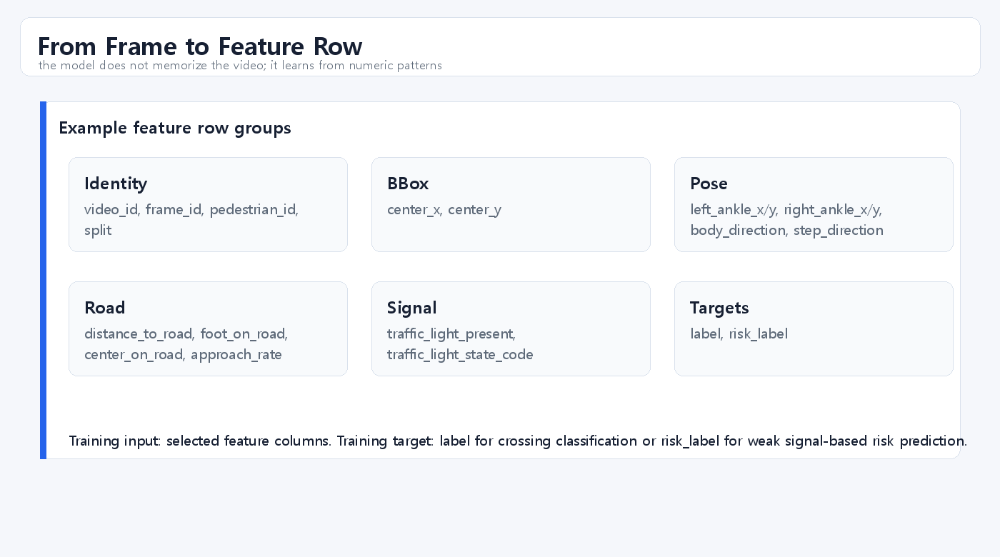
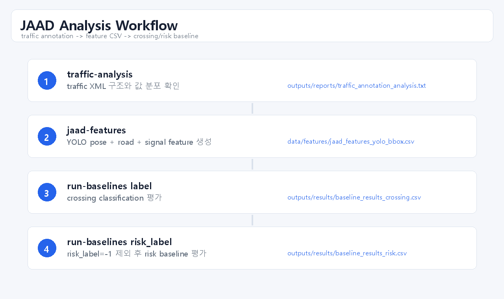
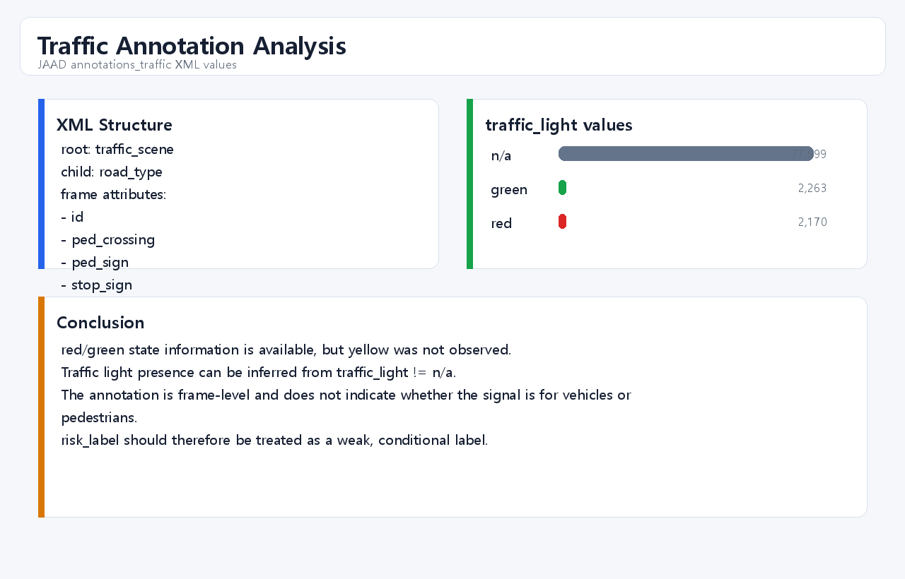
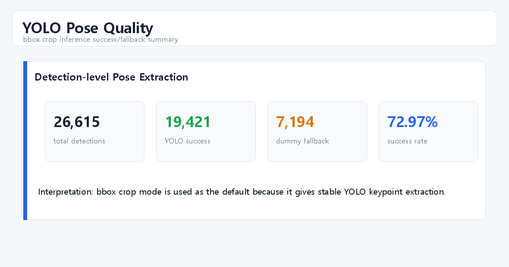
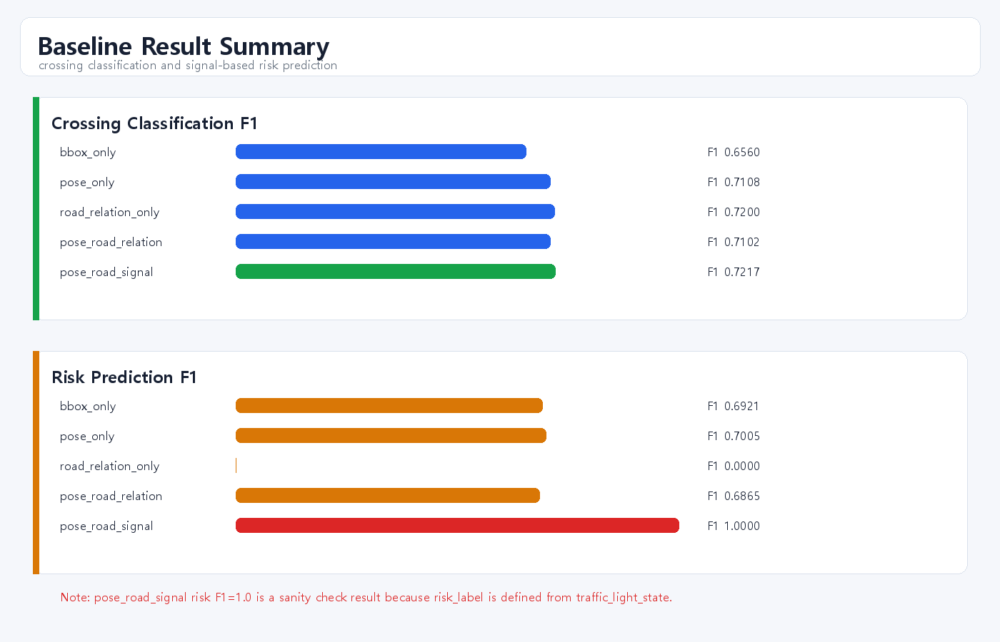

# Jaywalking Risk Recognition

JAAD(Joint Attention in Autonomous Driving) 데이터셋을 이용해 보행자의 무단횡단 위험 행동을 인식하는 연구용 Python 파이프라인입니다. 본 프로젝트는 보행자의 위치와 자세 정보뿐 아니라, 보행자와 도로 영역 사이의 공간 관계를 함께 사용했을 때 crossing 행동 인식 성능이 어떻게 달라지는지 실험하는 것을 목표로 합니다.

현재 구현은 JAAD annotation의 보행자 bounding box와 crossing label을 기반으로 feature CSV를 생성하고, JAAD official split을 사용해 RandomForest 및 LSTM baseline을 학습/평가합니다.

## Research Question

본 연구의 핵심 질문은 다음과 같습니다.

> 보행자의 pose 정보에 road relation feature를 결합하면, pose-only feature만 사용할 때보다 무단횡단 위험 행동 인식에 더 유용한가?

무단횡단 위험은 단순히 사람이 걷고 있는지, 어느 방향을 보고 있는지로만 결정되지 않습니다. 같은 walking pose라도 보행자가 인도 위에 있는지, 도로에 진입했는지, 도로와의 거리가 줄어드는지에 따라 위험도는 달라집니다. 따라서 본 연구는 다음 두 가지 정보를 함께 고려합니다.

- **Pose feature**: 보행자의 중심점, 발목 위치, 신체 방향, 보행 방향
- **Road relation feature**: 도로까지의 거리, 발/중심점의 도로 진입 여부, 도로 접근 속도

이 조합을 통해 보행자의 행동 자체와 도로 환경 내 위치 관계를 함께 반영하는 위험 행동 인식 모델을 구성합니다.

## Contributions

본 프로젝트의 현재 기여는 다음과 같습니다.

1. **JAAD annotation 기반 feature generation pipeline 구축**  
   JAAD XML annotation을 직접 파싱하여 frame별 pedestrian bbox, crossing label, action, look, occlusion 정보를 feature CSV로 변환합니다.

2. **Official split 기반 실험 환경 구성**  
   JAAD `split_ids`의 train/val/test split을 읽어 `jaad_features.csv`에 `split` 컬럼을 추가하고, 학습/평가 시 video-level leakage가 발생하지 않도록 검증합니다.

3. **Pose와 road relation feature 비교 실험 지원**  
   `bbox_only`, `pose_only`, `road_relation_only`, `pose_road_relation` feature set을 정의하고 RandomForest baseline을 자동 실행할 수 있습니다.

4. **데이터 품질 검증 및 리포트 생성 기능 추가**  
   전체 row 수, split 분포, label 분포, 결측치, feature 통계, video overlap 여부를 분석해 CSV 및 텍스트 리포트로 저장합니다.

## Experimental Setup

### Dataset

본 연구는 JAAD 2.0 데이터셋을 사용합니다.

- Dataset: JAAD
- Video clips: 346개
- Annotation format: XML
- Label source: pedestrian `cross` attribute
- Positive label: `crossing`
- Negative label: `not-crossing`

현재 데이터 위치:

```text
data/raw/JAAD/
  JAAD_clips/
    video_0001.mp4
    video_0002.mp4
    ...

data/raw/JAAD_annotations/
  annotations/
  annotations_appearance/
  annotations_attributes/
  annotations_traffic/
  annotations_vehicle/
  split_ids/
  jaad_data.py
```

### Split

기본 실험은 JAAD official split을 사용합니다.

현재 기본 설정은 전체 346개 영상을 포함하는 `all_videos` split입니다.

```yaml
jaad:
  split_subset: all_videos

training:
  split_strategy: official
```

`all_videos` split 구성:

| Split | Video Count |
|---|---:|
| train | 188 |
| val | 32 |
| test | 126 |

학습 시 `train + val`을 학습 데이터로 사용하고, `test`를 평가 데이터로 사용합니다. 학습 전 `video_id`가 train/val/test 사이에 중복으로 들어가지 않는지 검증합니다.

### Feature Sets

현재 지원하는 feature set은 다음과 같습니다.

| Feature Set | Included Features |
|---|---|
| `bbox_only` | `center_x`, `center_y` |
| `pose_only` | bbox 중심, 양쪽 발목 좌표, body direction, step direction |
| `road_relation_only` | `distance_to_road`, `foot_on_road`, `center_on_road`, `approach_rate` |
| `pose_road_relation` | pose feature + road relation feature |
| `pose_road_signal` | pose feature + road relation feature + encoded traffic light feature |

## Method

JAAD feature 생성 파이프라인은 다음 순서로 동작합니다.

```text
JAAD XML annotation
  -> video_id별 annotation 로드
  -> frame별 pedestrian bbox 추출
  -> cross 속성을 label로 변환
  -> official split 파일 기반 train/val/test 부여
  -> bbox를 Detection 객체로 변환
  -> dummy pose 또는 YOLO pose 추출
  -> road/sidewalk segmentation
  -> pose + road relation feature 계산
  -> data/features/jaad_features.csv 저장
  -> 품질 리포트 생성
  -> baseline 모델 학습 및 평가
```

현재 JAAD 모드는 로컬 `yolov8n-pose.pt` weights를 사용해 YOLO pose keypoint를 추출합니다. road/sidewalk segmentation은 아직 dummy road mask를 사용하며, 이후 실제 road/sidewalk segmentation 모델로 교체할 수 있도록 구조를 분리해두었습니다.

YOLO pose를 사용할 때는 weights를 인터넷에서 자동 다운로드하지 않습니다. `yolov8n-pose.pt` 또는 `yolov8s-pose.pt` 파일을 직접 받아서 `models/yolo/` 아래에 두고 `configs/default.yaml`의 `pose.model_path`를 해당 파일로 지정해야 합니다. weights 파일이 없으면 로그를 출력하고 dummy pose fallback을 사용합니다.

YOLO pose 품질 분석을 위해 detection별 keypoint 성공 여부와 dummy fallback 여부를 기록합니다. 현재는 `bbox`와 `full_frame` 두 inference mode를 모두 실행해 비교할 수 있으며, 전체 실험 결과에서는 bbox crop mode가 더 높은 keypoint 성공률과 pose 기반 baseline 성능을 보였습니다.

JAAD traffic annotation도 분석해 frame-level signal context feature를 추가했습니다. 현재 `traffic_light` 값은 `red`, `green`, `n/a`가 관측되며, `yellow`는 관측되지 않았습니다. 이 정보는 차량용/보행자용 신호 구분을 제공하지 않으므로, 새 `risk_label`은 신호등 context를 이용한 weak label로 취급합니다.

Road relation feature는 `RoadSegmenter`가 반환하는 road mask를 기준으로 계산합니다. 기본값은 기존과 동일한 `dummy` heuristic이며, 향후 실제 segmentation checkpoint를 연결할 수 있도록 `deeplabv3`, `segformer`, `yolo_seg` backend abstraction을 추가했습니다. segmentation model이 없거나 로드/추론에 실패하면 기존 dummy road mask로 fallback됩니다.

## Analysis Screenshots

아래 이미지는 분석 절차와 실제 출력 파일을 기반으로 생성한 화면 요약입니다.

논문/보고서에 어떤 output과 code change를 근거로 제시할지 정리한 문서는 [Paper Method Evidence](docs/paper_method_evidence.md)에 있습니다.













## Results

아래 결과는 `--limit-videos` 없이 전체 JAAD 346개 영상을 대상으로 YOLOv8 pose 기반 feature 생성을 수행한 뒤 얻은 실험 결과입니다.

### Data Quality Summary

전체 영상 346개를 처리 대상으로 실행했으며, 실패한 영상은 없었습니다. 현재 `sample_type: beh` 설정으로 behavior annotation이 있는 pedestrian만 feature row로 생성되므로, 최종 feature row가 생성된 video 수는 320개입니다.

| Metric | Value |
|---|---:|
| Attempted videos | 346 |
| Failed videos | 0 |
| Videos with feature rows | 320 |
| Total rows | 26,615 |
| Pedestrians | 686 |
| Missing values | 0 |
| Train rows | 13,269 |
| Val rows | 2,124 |
| Test rows | 11,222 |
| Train videos | 172 |
| Val videos | 30 |
| Test videos | 118 |
| Label 0 | 11,626 (43.68%) |
| Label 1 | 14,989 (56.32%) |
| Train/Test video overlap | 0 |
| Train/Val video overlap | 0 |
| Val/Test video overlap | 0 |

### Baseline Results

아래 표는 `outputs/results/baseline_results_yolo_bbox.csv` 및 `outputs/results/lstm_results.csv`를 기준으로 작성한 전체 JAAD 실험 결과입니다. RandomForest 결과는 bbox crop YOLO pose inference를 사용한 결과입니다.

| Feature Set | Model | Accuracy | Precision | Recall | F1 | Train Rows | Test Rows |
|---|---|---:|---:|---:|---:|---:|---:|
| `bbox_only` | RandomForest | 0.6043 | 0.6395 | 0.6733 | 0.6560 | 15,393 | 11,222 |
| `pose_only` | RandomForest | 0.6631 | 0.6847 | 0.7389 | 0.7108 | 15,393 | 11,222 |
| `road_relation_only` | RandomForest | 0.5653 | 0.5633 | 0.9975 | 0.7200 | 15,393 | 11,222 |
| `pose_road_relation` | RandomForest | 0.6626 | 0.6847 | 0.7376 | 0.7102 | 15,393 | 11,222 |
| `pose_road_signal` | RandomForest | 0.6794 | 0.7026 | 0.7419 | 0.7217 | 15,393 | 11,222 |
| `pose_road_relation` | LSTM | 0.6601 | 0.7647 | 0.6404 | 0.6971 | 12,659 seq. | 9,184 seq. |

### SegFormer Road Segmentation Results

아래 표는 전체 JAAD feature를 bbox crop YOLO pose와 SegFormer Cityscapes road segmentation backend로 다시 생성한 뒤, `outputs/results/baseline_results_crossing_segformer.csv`를 기준으로 작성한 RandomForest crossing classification 결과입니다.

SegFormer 전체 feature 생성에서는 26,615 rows 중 26,607 rows가 실제 `segformer` backend를 사용했고, 8 rows만 dummy fallback을 사용했습니다. 전체 `road_pixel_ratio`는 평균 0.2329, 최소 0.000026, 최대 0.4521로, dummy backend의 0.4500 고정값과 달리 frame별 road mask를 반영했습니다.

| Feature Set | Model | Accuracy | Precision | Recall | F1 | Train Rows | Test Rows |
|---|---|---:|---:|---:|---:|---:|---:|
| `bbox_only` | RandomForest | 0.6043 | 0.6395 | 0.6733 | 0.6560 | 15,393 | 11,222 |
| `pose_only` | RandomForest | 0.6631 | 0.6847 | 0.7389 | 0.7108 | 15,393 | 11,222 |
| `road_relation_only` | RandomForest | 0.6260 | 0.6625 | 0.6778 | 0.6701 | 15,393 | 11,222 |
| `pose_road_relation` | RandomForest | 0.7217 | 0.7460 | 0.7632 | 0.7545 | 15,393 | 11,222 |
| `pose_road_signal` | RandomForest | 0.7281 | 0.7571 | 0.7580 | 0.7575 | 15,393 | 11,222 |

Compared with the dummy-road baseline, replacing the heuristic road mask with SegFormer substantially improved `pose_road_relation` F1 from 0.7102 to 0.7545. This directly supports the main research question: road-relation features become useful when the road mask reflects actual scene geometry instead of a fixed lower-frame heuristic.

RandomForest diagnostic exports are generated with:

```powershell
.\.venv\Scripts\python.exe scripts\export_rf_diagnostics.py
```

Key outputs:

```text
outputs/reports/rf_diagnostics/confusion_matrix_summary_segformer_label.csv
outputs/reports/rf_diagnostics/feature_importance_segformer_label.csv
outputs/reports/rf_diagnostics/feature_group_importance_segformer_label.csv
outputs/reports/rf_diagnostics/ablation_dummy_vs_segformer_label.csv
outputs/figures/rf_diagnostics/random_forest_segformer_pose_road_relation_label_confusion_matrix.png
```

For `pose_road_relation`, SegFormer reduced false positives from 2,139 (`pose_only`) to 1,634 and reduced false negatives from 1,642 to 1,489. RandomForest feature importance ranked `distance_to_road` first, and road-relation features accounted for 0.2600 of the grouped importance in the combined pose-road model.

### YOLO Pose Quality

YOLO pose extraction quality was measured by counting whether each pedestrian detection produced YOLO keypoints or used dummy fallback pose.

| Inference Mode | Total Detections | YOLO Success | Dummy Fallback | Success Rate |
|---|---:|---:|---:|---:|
| `bbox` | 26,615 | 19,421 | 7,194 | 72.97% |
| `full_frame` | 26,615 | 11,947 | 14,668 | 44.89% |

The bbox crop mode produced substantially more successful YOLO keypoints than the full-frame matching mode.

### bbox vs full_frame Baseline Comparison

| Feature Set | bbox F1 | full_frame F1 |
|---|---:|---:|
| `bbox_only` | 0.6560 | 0.6560 |
| `pose_only` | 0.7108 | 0.7052 |
| `road_relation_only` | 0.7200 | 0.7198 |
| `pose_road_relation` | 0.7102 | 0.7013 |

`bbox_only` and `road_relation_only` are almost unchanged because they do not depend strongly on YOLO keypoint quality. In contrast, pose-based feature sets perform better with bbox crop inference. Therefore, subsequent experiments use `bbox` YOLO pose inference as the default setting.

### Traffic Annotation Analysis

JAAD traffic annotation XML files are stored under `data/raw/JAAD_annotations/annotations_traffic`. Each file uses a `traffic_scene` root with a `road_type` element and frame-level `frame` elements.

| Attribute | Description |
|---|---|
| `id` | frame id |
| `ped_crossing` | frame-level pedestrian crossing context |
| `ped_sign` | pedestrian sign presence |
| `stop_sign` | stop sign presence |
| `traffic_light` | traffic light state or `n/a` |

Observed `traffic_light` values:

| Value | Count |
|---|---:|
| `n/a` | 77,599 |
| `green` | 2,263 |
| `red` | 2,170 |

`red` and `green` states are available, but `yellow` was not observed. The XML does not indicate whether the signal is for vehicles or pedestrians.

### Risk Label Definition

The original `label` column is preserved as crossing classification. A conditional `risk_label` is added for signal-based risk prediction.

```text
IF label == 1 AND traffic_light_state == red
  risk_label = 1
ELSE IF traffic_light_state in [green, yellow]
  risk_label = 0
ELSE
  risk_label = -1
```

Rows with `risk_label = -1` are excluded when training with `--target-column risk_label`.

### Risk Prediction Baseline

The risk prediction baseline uses only rows with valid `risk_label` values. From 26,615 total feature rows, 1,470 rows are trainable for risk prediction.

Risk label distribution:

| risk_label | Count |
|---|---:|
| `-1` | 25,145 |
| `0` | 904 |
| `1` | 566 |

RandomForest risk prediction results:

| Feature Set | Accuracy | Precision | Recall | F1 | Train Rows | Test Rows |
|---|---:|---:|---:|---:|---:|---:|
| `bbox_only` | 0.7623 | 0.9007 | 0.5620 | 0.6921 | 961 | 509 |
| `pose_only` | 0.7800 | 0.9924 | 0.5413 | 0.7005 | 961 | 509 |
| `road_relation_only` | 0.5246 | 0.0000 | 0.0000 | 0.0000 | 961 | 509 |
| `pose_road_relation` | 0.7721 | 0.9922 | 0.5248 | 0.6865 | 961 | 509 |
| `pose_road_signal` | 1.0000 | 1.0000 | 1.0000 | 1.0000 | 961 | 509 |

The perfect `pose_road_signal` risk score should not be interpreted as general risk prediction performance. The current `risk_label` is directly derived from `traffic_light_state`, and `pose_road_signal` includes `traffic_light_state_code`, so the model can learn the label rule itself. This result is useful as a pipeline sanity check, while future risk prediction experiments should avoid this direct target-feature dependency or use a stronger independent risk label.

### Signal Presence Split Experiment

To check whether traffic-light context changes crossing classification behavior, the feature CSV was split by `traffic_light_present`.

| Group | Rows | Train Rows | Test Rows |
|---|---:|---:|---:|
| signal present | 1,938 | 1,195 | 743 |
| signal absent | 24,677 | 14,198 | 10,479 |

RandomForest F1 by group:

| Feature Set | Signal Present F1 | Signal Absent F1 |
|---|---:|---:|
| `bbox_only` | 0.6667 | 0.6607 |
| `pose_only` | 0.6912 | 0.7190 |
| `road_relation_only` | 0.6999 | 0.7214 |
| `pose_road_relation` | 0.6882 | 0.7212 |
| `pose_road_signal` | 0.6828 | 0.7216 |

The signal-present subset is much smaller and covers fewer videos, so its metrics are less stable. In this split, pose/road-based F1 scores were higher in the signal-absent group. The signal-present group should be interpreted as a targeted subset analysis rather than a direct replacement for the full JAAD baseline.

### LSTM Sequence Statistics

| Split | Sequences | Label 0 | Label 1 | Excluded Short Tracks |
|---|---:|---:|---:|---:|
| Train | 12,659 | 4,917 | 7,742 | 12 |
| Test | 9,184 | 3,575 | 5,609 | 5 |

## Discussion

전체 JAAD 실험 결과에서 `pose_only` RandomForest는 `bbox_only`보다 높은 F1을 보였습니다. 이는 보행자의 중심 위치만 사용하는 것보다 YOLO pose에서 얻은 발목 위치, body direction, step direction과 같은 pose-derived feature가 crossing classification에 추가 정보를 제공한다는 점을 시사합니다.

YOLO pose 품질 분석에서는 bbox crop mode가 full-frame matching mode보다 더 안정적이었습니다. bbox mode의 keypoint success rate는 72.97%였고 full_frame mode는 44.89%였습니다. 이 차이는 pose 기반 feature set의 성능 차이에도 반영되어, `pose_only`와 `pose_road_relation` 모두 bbox mode에서 더 높은 F1을 보였습니다.

`road_relation_only`는 dummy backend에서는 accuracy는 낮고 recall이 매우 높게 나타났습니다. 이는 dummy road mask가 도로 접근 또는 도로 위 여부를 넓게 포착하면서 positive class를 적극적으로 예측하는 경향을 만든 것으로 해석할 수 있습니다. SegFormer backend에서는 `road_relation_only`의 recall 편향이 줄어들고 precision/recall이 더 균형적인 형태로 바뀌었습니다.

RandomForest 기준 dummy backend에서는 `pose_only`와 `pose_road_relation`의 F1이 거의 비슷했습니다. 하지만 전체 JAAD에 SegFormer road segmentation을 적용하자 `pose_road_relation` F1이 0.7545로 상승해 `pose_only` F1 0.7108보다 명확히 높아졌습니다. 이는 road relation feature의 이점이 실제 road/sidewalk mask 품질에 크게 의존한다는 점을 보여줍니다. 이번 LSTM `pose_road_relation` 결과는 F1 0.6971로 RandomForest pose 계열보다 약간 낮았습니다. 다만 precision은 0.7647로 가장 높아, sequence model이 더 보수적으로 positive class를 예측하는 경향을 보였습니다.

Signal context를 추가한 `pose_road_signal`은 dummy backend crossing classification에서 F1 0.7217을 기록했고, SegFormer backend에서는 F1 0.7575를 기록했습니다. 이는 frame-level traffic context가 crossing classification에 추가 정보를 줄 수 있음을 보여줍니다. 다만 risk prediction에서는 `risk_label`이 traffic light state로부터 정의되므로, signal feature를 포함한 모델의 F1 1.0은 규칙 재현에 가깝습니다.

## Limitations

현재 구현에는 다음 한계가 있습니다.

- **YOLO pose 품질 의존성**: 현재 JAAD 모드는 로컬 YOLOv8n pose weights를 사용합니다. bbox crop 기반 inference에서 keypoint가 검출되지 않으면 dummy pose fallback을 사용하므로, pose feature 품질은 YOLO 검출 품질에 영향을 받습니다.
- **full-frame pose matching 한계**: full-frame mode는 한 frame에서 검출된 pose와 JAAD bbox를 매칭해야 하므로 bbox crop mode보다 fallback 비율이 높았습니다. 현재 실험에서는 bbox crop mode를 기본값으로 사용합니다.
- **Dummy road segmentation**: 현재 road mask는 화면 하단 영역을 도로로 가정하는 단순 heuristic입니다. 실제 도로/인도 경계를 정확히 반영하지 못합니다.
- **Segmentation model availability**: 실제 road/sidewalk segmentation backend는 로컬 checkpoint가 있을 때만 사용합니다. checkpoint가 없거나 road mask가 비어 있으면 dummy mask로 fallback합니다.
- **Traffic signal context 한계**: JAAD traffic annotation은 frame-level `traffic_light` 상태를 제공하지만, 해당 신호가 차량용인지 보행자용인지 구분하지 않습니다. 따라서 `risk_label`은 강한 ground truth가 아니라 조건부 weak label입니다.
- **Behavior-only row 생성**: 전체 346개 영상을 처리했지만 `sample_type: beh` 설정 때문에 feature row가 생성된 video는 320개입니다.
- **Label 정의의 단순성**: 현재 label은 JAAD `cross` 속성만 사용합니다. action, look, traffic, vehicle annotation은 아직 위험도 정의에 통합되지 않았습니다.
- **Temporal modeling 제한**: LSTM baseline은 구현되어 있으나 sequence 구성, normalization, imbalance 처리, split 전략을 더 정교화할 필요가 있습니다.

## Future Work

다음 단계에서는 아래 개선을 목표로 합니다.

1. **YOLO pose 품질 개선**  
   bbox crop mode를 기본값으로 사용하되, keypoint confidence threshold 조정과 fallback 발생 frame 분석을 통해 pose feature 신뢰도를 더 높입니다.

2. **실제 road/sidewalk segmentation 적용**  
   dummy road mask를 segmentation model 또는 annotation 기반 road mask로 교체해 `distance_to_road`, `foot_on_road`, `center_on_road` feature의 신뢰도를 높입니다.

3. **Full-result table 자동 갱신**  
   `baseline_results.csv`, `lstm_results.csv`, `experiment_summary.csv`를 README Markdown table로 자동 반영하는 스크립트를 추가합니다.

4. **ST-GCN 기반 시공간 pose 모델 검토**  
   보행자의 keypoint sequence를 graph 구조로 표현해 ST-GCN 또는 유사한 spatio-temporal graph model을 적용합니다.

5. **Context annotation 통합**  
   traffic light, vehicle action, pedestrian look/action 정보를 결합해 crossing 여부뿐 아니라 위험 상황 예측으로 확장합니다.

## Installation

```powershell
cd D:\reserch\jaywalking-risk-recognition
py -3.10 -m venv .venv
.\.venv\Scripts\Activate.ps1
python -m pip install --upgrade pip
pip install -r requirements.txt
```

이미 `.venv`가 있다면 다음처럼 실행할 수 있습니다.

```powershell
cd D:\reserch\jaywalking-risk-recognition
.\.venv\Scripts\python.exe main.py --help
```

## GPU / CUDA Environment

전체 JAAD feature 생성에서 YOLO pose inference를 사용할 경우 CPU보다 GPU 실행이 훨씬 빠릅니다. 현재 환경은 `.venv` 안에 CUDA 지원 PyTorch를 설치해 GPU 사용이 가능하도록 구성합니다.

GPU 인식 여부 확인:

```powershell
cd D:\reserch\jaywalking-risk-recognition
.\.venv\Scripts\python.exe -c "import torch; print(torch.__version__); print(torch.cuda.is_available()); print(torch.cuda.get_device_name(0) if torch.cuda.is_available() else 'CUDA not available')"
```

`torch.cuda.is_available()`가 `True`이고 GPU 이름이 출력되면 GPU 사용 준비가 된 상태입니다.

CUDA 지원 PyTorch 재설치가 필요한 경우:

```powershell
.\.venv\Scripts\python.exe -m pip uninstall -y torch torchvision torchaudio
.\.venv\Scripts\python.exe -m pip install torch torchvision torchaudio --index-url https://download.pytorch.org/whl/cu121
```

GPU 사용 대상:

- YOLOv8 pose inference
- LSTM 학습

RandomForest는 scikit-learn 기반이므로 기본적으로 CPU에서 실행됩니다.

## Local YOLO Pose Weights

YOLOv8 pose backend는 로컬 weights 파일만 사용합니다. 자동 다운로드는 수행하지 않습니다.

권장 위치:

```text
models/yolo/yolov8n-pose.pt
models/yolo/yolov8s-pose.pt
```

설정 예:

```yaml
pose:
  backend: yolo
  model_path: models/yolo/yolov8n-pose.pt
  confidence_threshold: 0.25
  inference_mode: bbox

jaad:
  pose_backend: yolo
```

`pose.inference_mode`는 두 가지를 지원합니다.

- `bbox`: annotation 또는 detector bbox 영역을 crop한 뒤 pose keypoint 추출
- `full_frame`: full frame에서 pose를 추출한 뒤 bbox와 매칭

weights 파일이 없거나 keypoint가 검출되지 않으면 bbox 기반 dummy pose로 fallback합니다.

## Road Segmentation Backend

Road relation feature는 road mask를 기반으로 계산됩니다.

```text
video frame
  -> road segmentation backend
  -> road mask
  -> distance_to_road, foot_on_road, center_on_road, approach_rate
```

지원 backend:

| Backend | 설명 |
|---|---|
| `dummy` | 기존 방식. 화면 하단 45%를 road로 가정 |
| `deeplabv3` | 로컬 DeepLabV3 checkpoint 기반 semantic segmentation |
| `segformer` | HuggingFace `nvidia/segformer-b2-finetuned-cityscapes-1024-1024` pretrained Cityscapes semantic segmentation |
| `yolo_seg` | 로컬 YOLO segmentation weights 기반 instance/semantic mask 추출 |

기본 설정은 backward compatibility를 위해 `dummy`입니다.

```yaml
segmentation:
  backend: dummy
  model_name: nvidia/segformer-b2-finetuned-cityscapes-1024-1024
  model_path: null
  road_class_ids: [0]
  sidewalk_class_ids: [1]
  road_class_names: [road, street]
  sidewalk_class_names: [sidewalk, pavement]
```

실제 segmentation model을 사용할 때는 로컬 checkpoint 경로를 지정합니다.

SegFormer Cityscapes backend:

`segformer` uses `transformers` `from_pretrained` loading, not a git clone or local model repository. On the first run, HuggingFace downloads `nvidia/segformer-b2-finetuned-cityscapes-1024-1024` into the local cache; later runs reuse that cache. Cityscapes class id `0` is treated as road and class id `1` as sidewalk.

```powershell
.\.venv\Scripts\python.exe scripts\run_road_segmentation_example.py --backend segformer

.\.venv\Scripts\python.exe main.py --mode jaad-features --pose-inference-mode bbox --segmentation-backend segformer --limit-videos 5 --output-csv data\features\test_jaad_features_road_segformer_5.csv

.\.venv\Scripts\python.exe scripts\compare_road_relation_features.py --dummy-csv data\features\test_jaad_features_road_dummy_5.csv --backend-csv data\features\test_jaad_features_road_segformer_5.csv --backend-name segformer
```

Successful SegFormer runs should record `segmentation_backend_requested=segformer`, `segmentation_backend=segformer`, `segmentation_source=segformer`, `segmentation_fallback=0`, and frame-dependent `road_pixel_ratio` values rather than the dummy `0.4500` constant.

Current 5-video sanity check result: 456 feature rows used `segformer` with `segmentation_fallback=0`; `road_pixel_ratio` mean/min/max was 0.1763/0.0298/0.2615. The comparison report shows dummy `road_pixel_ratio=0.4500` while SegFormer varies by frame.

Full JAAD SegFormer run result: 26,607 of 26,615 feature rows used `segformer` with `segmentation_fallback=0`, and only 8 rows used dummy fallback. The full-run `road_pixel_ratio` mean/min/max was 0.2329/0.000026/0.4521.

```powershell
.\.venv\Scripts\python.exe main.py --mode jaad-features --segmentation-backend yolo_seg --segmentation-model-path models\segmentation\road-seg.pt
```

model이 없거나 추론이 실패하면 기존 dummy road mask로 fallback되며, feature CSV에는 segmentation metadata가 함께 저장됩니다.

```text
segmentation_backend
segmentation_backend_requested
segmentation_source
segmentation_fallback
road_pixel_ratio
```

road segmentation 품질 리포트:

```text
outputs/reports/road_segmentation_report.csv
outputs/reports/road_segmentation_summary.txt
```

로컬 checkpoint가 있는지 확인하고 1프레임 road mask 예제를 생성하려면 다음 스크립트를 사용합니다.

```powershell
.\.venv\Scripts\python.exe scripts\run_road_segmentation_example.py --backend yolo_seg
```

현재 저장소의 `models/segmentation/`에는 checkpoint가 없으므로 위 예제는 dummy fallback을 기록합니다. checkpoint를 추가한 뒤에는 `--model-path`를 지정하면 됩니다.

```powershell
.\.venv\Scripts\python.exe scripts\run_road_segmentation_example.py --backend yolo_seg --model-path models\segmentation\road-seg.pt
```

dummy backend와 segmentation backend의 road-relation feature 분포 비교:

```powershell
.\.venv\Scripts\python.exe scripts\compare_road_relation_features.py --dummy-csv data\features\test_jaad_features_road_dummy_5.csv --backend-csv data\features\test_jaad_features_road_yolo_seg_5.csv --backend-name yolo_seg
```

출력:

```text
outputs/reports/road_relation_comparison.csv
```

## Usage

### JAAD Feature 생성

전체 346개 영상 처리:

```powershell
.\.venv\Scripts\python.exe main.py --mode jaad-features
```

YOLO bbox crop mode로 feature와 pose 품질 리포트 생성:

```powershell
.\.venv\Scripts\python.exe main.py --mode jaad-features --pose-inference-mode bbox
```

YOLO full-frame mode로 feature와 pose 품질 리포트 생성:

```powershell
.\.venv\Scripts\python.exe main.py --mode jaad-features --pose-inference-mode full_frame
```

위 두 명령은 각각 다음 feature CSV를 저장합니다.

```text
data/features/jaad_features_yolo_bbox.csv
data/features/jaad_features_yolo_full_frame.csv
```

일부 영상만 처리:

```powershell
.\.venv\Scripts\python.exe main.py --mode jaad-features --limit-videos 20
```

특정 영상 하나만 처리:

```powershell
.\.venv\Scripts\python.exe main.py --mode jaad-features --jaad-video-id video_0002 --limit-videos 1
```

실패한 영상은 다음 파일에 기록됩니다.

```text
outputs/logs/jaad_failed_videos.txt
```

### Data Quality Report 생성

feature CSV 생성 후 자동으로 생성되며, 수동으로 다시 만들 수도 있습니다.

```powershell
.\.venv\Scripts\python.exe main.py --mode quality-report --csv-path data\features\jaad_features.csv
```

출력 파일:

```text
outputs/reports/jaad_data_quality_report.csv
outputs/reports/jaad_data_quality_summary.txt
```

### YOLO Pose 품질 리포트

JAAD feature 생성 중 detection별 YOLO keypoint 성공 여부와 dummy fallback 여부를 집계합니다. 최신 실행 결과는 아래 파일에 저장됩니다.

```text
outputs/reports/pose_detection_report.csv
outputs/reports/pose_detection_summary.txt
outputs/reports/pose_detection_events.csv
```

mode별 비교용 파일도 함께 저장됩니다.

```text
outputs/reports/pose_detection_report_yolo_bbox.csv
outputs/reports/pose_detection_summary_yolo_bbox.txt
outputs/reports/pose_detection_events_yolo_bbox.csv
outputs/reports/pose_detection_report_yolo_full_frame.csv
outputs/reports/pose_detection_summary_yolo_full_frame.txt
outputs/reports/pose_detection_events_yolo_full_frame.csv
```

현재 전체 JAAD 기준 bbox mode는 success rate 72.97%, full_frame mode는 44.89%입니다. 따라서 기본 실험 결과는 bbox mode를 기준으로 해석합니다.

### Traffic Annotation 분석

```powershell
.\.venv\Scripts\python.exe main.py --mode traffic-analysis
```

출력 파일:

```text
outputs/reports/traffic_annotation_analysis.txt
outputs/reports/traffic_annotation_values.csv
```

### RandomForest 학습

```powershell
.\.venv\Scripts\python.exe main.py --mode train-rf --csv-path data\features\jaad_features.csv --feature-set pose_road_relation
```

### LSTM 학습

```powershell
.\.venv\Scripts\python.exe main.py --mode train-lstm --csv-path data\features\jaad_features.csv --feature-set pose_road_relation
```

### Baseline 실험 자동 실행

```powershell
.\.venv\Scripts\python.exe main.py --mode run-baselines --csv-path data\features\jaad_features.csv
```

출력 파일:

```text
outputs/results/baseline_results.csv
```

bbox/full-frame YOLO feature CSV 기준 baseline은 다음처럼 실행합니다.

```powershell
.\.venv\Scripts\python.exe main.py --mode run-baselines --pose-inference-mode bbox
.\.venv\Scripts\python.exe main.py --mode run-baselines --pose-inference-mode full_frame
```

출력 파일:

```text
outputs/results/baseline_results_yolo_bbox.csv
outputs/results/baseline_results_yolo_full_frame.csv
```

crossing classification과 risk prediction target은 다음처럼 선택합니다.

```powershell
.\.venv\Scripts\python.exe main.py --mode run-baselines --target-column label
.\.venv\Scripts\python.exe main.py --mode run-baselines --target-column risk_label
```

출력 파일:

```text
outputs/results/baseline_results_crossing.csv
outputs/results/baseline_results_risk.csv
```

## Data Validation

학습 전 다음 항목을 자동으로 검사합니다.

- label이 한쪽 클래스만 있는지 확인
- train/test에 동일 `video_id`가 섞였는지 확인
- NaN 또는 inf 값이 있는지 확인
- feature column 누락 여부 확인

심각한 문제가 있으면 학습을 중단합니다. test split에 한쪽 label만 있는 경우처럼 metric 해석에 주의가 필요한 상황은 warning으로 출력합니다.

## Project Structure

```text
main.py
  CLI entrypoint

src/jaad_loader.py
  JAAD XML annotation 및 official split loader

src/dataset_builder.py
  feature CSV 생성

src/data_quality.py
  품질 리포트 및 학습 전 검증

src/baseline_runner.py
  feature set별 RandomForest baseline 실행

src/train_random_forest.py
  RandomForest 학습 및 평가

src/train_lstm.py
  LSTM 학습 및 평가

configs/default.yaml
  경로, split, feature set, 학습 설정
```

## References

JAAD 2.0 repository:

```text
https://github.com/ykotseruba/JAAD
```

JAAD video clips:

```text
http://data.nvision2.eecs.yorku.ca/JAAD_dataset/data/JAAD_clips.zip
```
